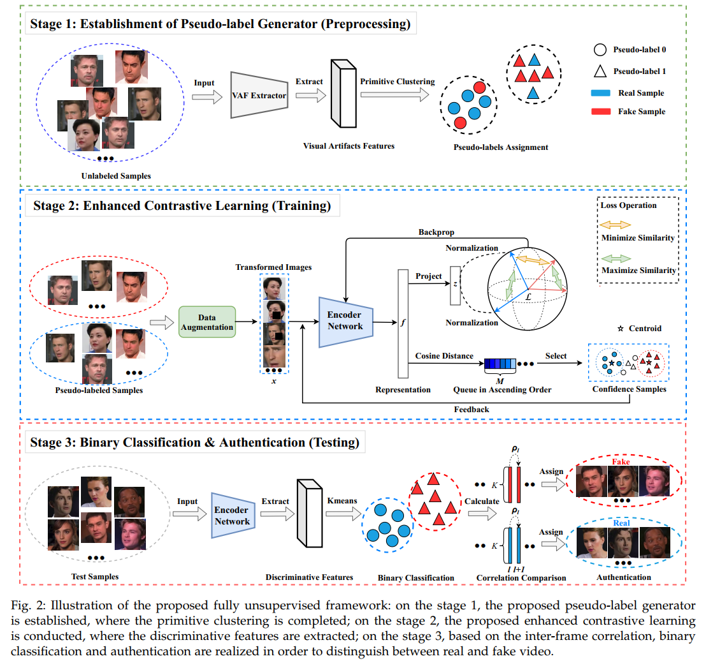

# Introduction
This repository contains PyTorch implementation of the TPAMI paper:
## Fully Unsupervised Deepfake Video Detection via Enhanced Contrastive Learning

Paper link:

# Environment
Python==3.7.6, torch==1.10.1, torchvision==0.11.2, cudatoolkit==11.1

# Run
Stage 1 code: pseudo_label_generator.py

Stage 2 code: enhanced_contrastive_learner.py

Stage 3 code: binary_classifier.py

# Citations
Please cite the following paper in your publications if you use the python implementations:

# Acknowledgments
This is an [example link](https://github.com/sthalles/SimCLR).
